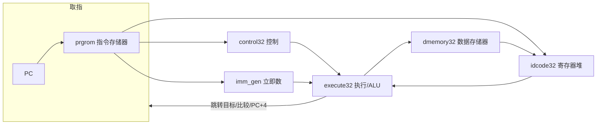
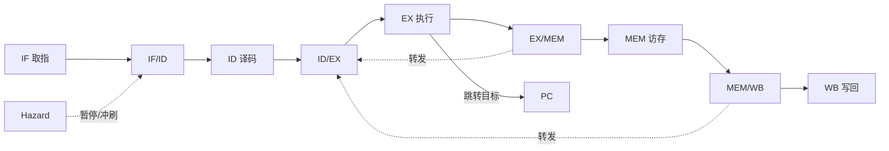

# minisys_rv32 —— 单周期 RV32I RISC-V 处理器 · 进度与深度存档（PART 1）

> **文档定位**：本文件是项目 `minisys_rv32` 的第一阶段存档点，记录已完成的工作、技术深度、验证结论、踩坑修复与流水线升级规划。可用于课程设计结题、保研材料或项目简历的技术沉淀。
>
> **存档日期**：2026-08-20 ｜ **状态**：单周期整机**仿真验证通过**，流水线/上板待做

---

## 一、项目一句话定位

> 基于 FPGA（Vivado / Xilinx）从零设计并仿真验证通过的单周期 RV32I RISC-V 处理器，覆盖基础指令集六类指令，完成「指令集分析 → 模块设计 → 逐模块仿真 → 整机联调」全流程，并已规划 5 级流水线升级。

但是对于时序问题也是其中的核心问题！！！！

---

## 二、已完成工作清单

### 2.1 硬件模块（`src/`，7 个模块 + 顶层）

| 模块          | 文件            | 职责                                                                          |
| ------------- | --------------- | ----------------------------------------------------------------------------- |
| 取指          | `ifetch32.v`  | PC 寄存器（下降沿更新、异步复位）、`prgrom` 读指令、按 branch 选择下一 PC   |
| 控制          | `control32.v` | 按 opcode 译码出 ExtOp/RegWr/MemWr/MemtoReg/ALUASrc/ALUBSrc/LUI/ALUctr/Branch |
| 立即数        | `imm_gen32.v` | I/S/B/U/J 五种立即数编码的符号/零扩展                                         |
| 译码/寄存器堆 | `idcode32.v`  | 组合读 rs1/rs2，正沿写回 rd（x0 恒 0 保护）                                   |
| 执行          | `execute32.v` | ALU 全运算、比较输出、跳转目标计算、PC+4                                      |
| 数据存储      | `dmemory32.v` | LB/LH/LW/LBU/LHU 符号/零扩展、SB/SH/SW 字节写使能、写数据按偏移对齐           |
| 顶层          | `minisys.v`   | 模块互连，`SYNTHESIS` 宏区分上板时钟(IP)/仿真直连                           |

### 2.2 仿真验证（`sim/`，7 个 testbench）

| 仿真              | 覆盖内容                                              | 结果           |
| ----------------- | ----------------------------------------------------- | -------------- |
| `control32_sim` | 各 opcode 控制信号译码                                | 通过           |
| `imm_gen32_sim` | I/S/B/U/J 立即数扩展                                  | 通过           |
| `ifetch32_sim`  | 复位、顺序取指、beq/bne/blt/bge/bltu/bgeu、JAL/JALR   | 通过           |
| `idcode32_sim`  | 复位清零、ALU/load 写回、x0 屏蔽、RegWr=0             | 通过           |
| `execute32_sim` | ALU 全部运算、比较、LUI/AUIPC、跳转目标、PC+4         | 通过           |
| `dmemory32_sim` | SW/LW、SB/SH/LB/LH/LBU/LHU 读写与扩展                 | 通过           |
| `minisys_sim`   | **整机测试程序**（见 §6），自动 PASS/FAIL 断言 | **PASS** |

### 2.3 工程支撑

- 行为级 `prgrom`/`ram` 模型 + 宏切换（`+define+PRGROM_IP / RAM_IP`），仿真可脱离 IP 运行
- RISC-V 测试程序 .coe 生成（`coe/prgmip32.coe`）
- 仓库级记忆（`/memories/repo/minisys_rv32.md`）记录接口约定与易错点

---

## 三、架构与数据通路



**关键数据通路连接**：`Instruction[6:0]→opcode`，`[14:12]→func3`，`[31:25]→func7`，`[19:15]/[24:20]/[11:7]→ra/rb/rd`；`ALU_result→写回数据/访存地址`；`rs2→存储数据`；`Location_Result/PC_plus_4/less/lessu/zero→取指`。

---

## 四、指令集覆盖（RV32I 基础集）

- **R 型**：ADD/SUB/AND/OR/XOR/SLL/SRL/SRA/SLT/SLTU
- **I 型**：ADDI/SLTI/SLTIU/XORI/ORI/ANDI/SLLI/SRLI/SRAI；加载 LB/LH/LW/LBU/LHU；JALR
- **S 型**：SB/SH/SW
- **B 型**：BEQ/BNE/BLT/BGE/BLTU/BGEU
- **U 型**：LUI/AUIPC
- **J 型**：JAL
- 立即数：I/S/B/U/J 五种编码均由 `imm_gen` 处理（B/J 已 <<1，U 已 <<12）
- 访存：字节/半字/字读写，含符号/零扩展与字节写使能

---

## 五、时序方案（关键技术理解）

**现状：非严格单周期，采用"双沿/两相"方案**（沿用 minisys2.0 教学思路）：

| 状态元件   | 更新沿               | 说明                                 |
| ---------- | -------------------- | ------------------------------------ |
| PC         | 下降沿               | 负沿更新，配合 BRAM 正沿读           |
| 寄存器堆   | 上升沿               | 指令结果在周期中段写回               |
| 数据存储器 | 反相时钟（下降沿写） | 补偿 BRAM 固有延迟                   |
| prgrom/ram | BRAM 寄存器输出      | 读地址后一拍出数据，靠相位差"藏"延迟 |

**为什么负沿取指**：BRAM 在上升沿采样地址，若 PC 同沿变化会产生竞争；负沿更新 PC 使上升沿采样时地址稳定，指令在周期后半段可用。

**结论**：功能上为单周期（无流水、每周期一条指令、数据通路纯组合），时序上为多沿双相方案，**非教科书意义的严格单周期**（严格单周期要求所有状态元件同沿）。这对流水线改造有直接约束（见 §9）。

---

## 六、验证结论（整机）

测试程序（`coe/prgmip32.coe`）：

| 地址 | 指令         | 效果     |
| ---- | ------------ | -------- |
| 0    | addi x1,x0,5 | x1=5     |
| 4    | addi x2,x0,3 | x2=3     |
| 8    | add x3,x1,x2 | x3=8     |
| 12   | sw x3,0(x0)  | mem[0]=8 |
| 16   | lw x4,0(x0)  | x4=8     |
| 20   | beq x3,x4,8  | 跳 28    |
| 28   | jal x0,8     | 跳 36    |
| 36   | sub x7,x4,x1 | x7=3     |
| 40   | jal x0,0     | 死循环   |

**整机仿真结果**：`x1=5 x2=3 x3=8 x4=8 x5=0 x6=0 x7=3 mem[0]=8 PC=0x28` → **PASS**（同时验证了分支跳转与指令跳过）。

---

## 七、踩坑与修复记录（工程能力沉淀）

1. **Verilog 移位宽度截断陷阱**：`wdata << (addr[1:0] << 3)` 中移位量被截断为左操作数位宽（2 位），`3<<3=24` 截成 0，导致 SB/SH 非零偏移写错高位。**修复**：用 32 位乘法 `wdata << (addr[1:0]*32'd8)`。
2. **JALR 目标未按规范**：`(rs1+imm)` 缺少 `& ~1` 清零最低位。**修复**：`(rs1+imm) & ~32'd1`。
3. **控制单元优先级 bug**：`ALUBSrc` 中 JALR 同时命中两个条件（三元运算符先匹配先赢），导致 JALR 链接地址算成 `PC+imm` 而非 `PC+4`。**修复**：将 JALR 移入 `2'b10` 分支。
4. **端口/位宽/连接错误**：`next_PC` 位宽冲突且误用 `wire`（应在 always 中赋值）、`branch`/`func3` 位宽不足导致 JAL/JALR 与分支类型不可达、`prorom` 拼写、模块名 `imm_gen` 误写 `imm_gen32`、顶层缺逗号/重复声明/大小写不一致等。
5. **行为模型与 IP 同名冲突**：行为级 `prgrom`/`ram` 与 Xilinx IP 在 xsim 中重复定义。**解决**：`ifndef PRGROM_IP / RAM_IP` 宏保护。
6. **整机时钟问题**：仿真依赖 `cpuclk` 分频 IP 且输入频率不匹配导致内部时钟停摆（PC 只跳一次）。**解决**：`SYNTHESIS` 宏使仿真直连 `clock=clk`，上板综合才用 IP。
7. **行为模型读数据与 BRAM 寄存器输出的差异**：组合读 vs 一拍延迟，已明确时序影响并统一到正沿流水方案（§9）。

---

## 八、与"严格单周期"的差距（现状边界）

- ✅ 无流水寄存器、组合数据通路、每周期一条指令
- ❌ 状态元件分属不同沿（负沿 PC / 正沿寄存器 / 反相时钟访存）
- ❌ BRAM 寄存器输出带一拍延迟，靠时钟相位差掩盖
- ❌ 尚未上板（综合/实现/bitstream），目前为**仿真层验证通过**

---

## 九、流水线升级规划（5 级）

**总原则**：先统一时钟为正沿，再插入流水寄存器与冒险处理。



**关键机制**：

- 控制信号随流水寄存器逐级下传（ID 译码 → ID/EX → EX/MEM → MEM/WB）
- 转发：EX/MEM 与 MEM/WB 结果前送到 EX 的 rs1/rs2
- 冒险：load-use 暂停 1 拍；分支/JAL/JALR 命中则冲刷 IF/ID
- PC 源：跳转目标(EX) / PC+4 / 暂停保持

**里程碑**：

- M1 统一正沿 + 4 组流水寄存器（无冒险程序跑通）
- M2 控制信号流水化
- M3 转发单元（ALU-ALU 前向）
- M4 冒险检测 + load-use 暂停
- M5 分支/JAL/JALR 冲刷 + 链接地址写回
- M6 扩展整机测试（覆盖所有指令 + 冒险场景）

**决策点**：分支在 EX 解析（推荐）；predict not-taken + flush；转发两级；保留 `SYNTHESIS` 宏。

---

## 十、诚实边界（已完成 / 待做）

| 已完成                               | 待做                                |
| ------------------------------------ | ----------------------------------- |
| 单周期整机**仿真**调通（PASS） | 上板（综合→实现→bitstream→真机） |
| 六类指令、完整访存、分支跳转         | 流水线实现（仅规划）                |
| 7 个 testbench + 自动断言            | 中断 / 外设 / 总线扩展              |
| 测试程序与 coe 生成                  | 完整设计报告文档                    |

---

## 十一、目录结构

```
minisys_rv32/
├── src/            # 硬件源码（7 模块 + 顶层）
├── sim/            # 7 个仿真 testbench
├── coe/            # 测试程序 prgmip32.coe
├── xdc/            # 约束（待补）
├── bitstream/      # 上板产物（待做）
└── README_PART1.md # 本文档
```

## 十二、运行方式

```bash
# 整机仿真（使用行为级模型，无需 IP）
iverilog -o minisys_sim.out minisys_rv32/src/*.v minisys_rv32/sim/minisys_sim.v
vvp minisys_sim.out
# Vivado/xsim：将 prgrom/ram 换成工程内 Xilinx IP，仿真直连 clock=clk
```

---

*存档点 Part 1 —— 单周期 RV32I 仿真验证通过。下一步：M1 统一正沿 + 流水寄存器。*
